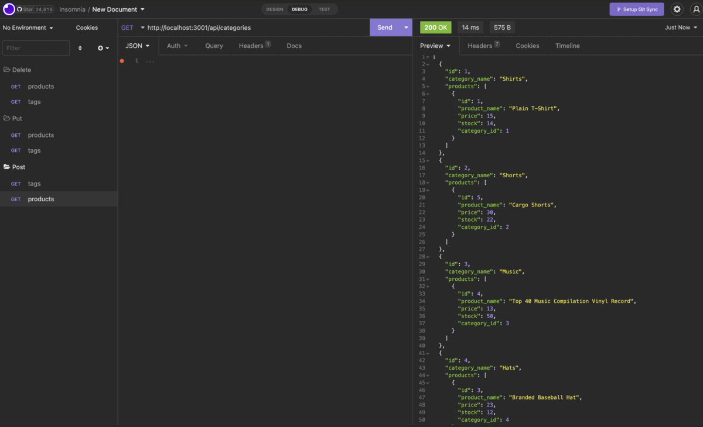
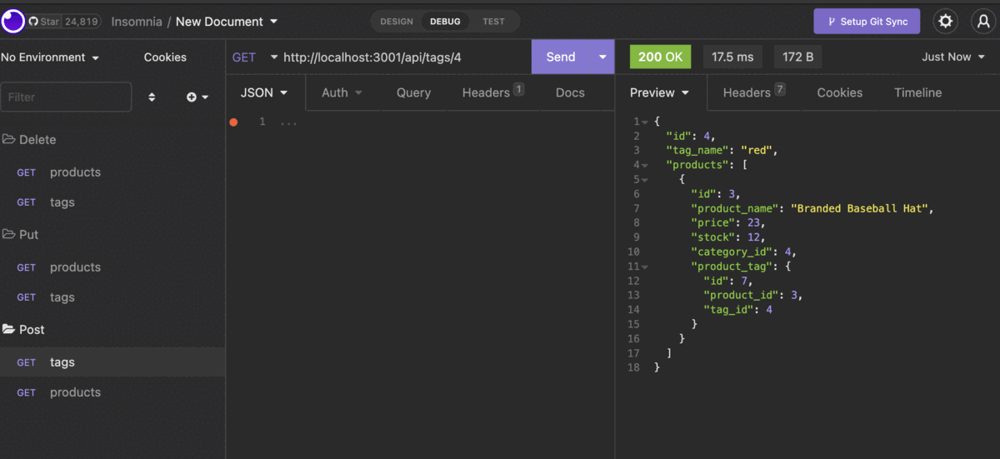
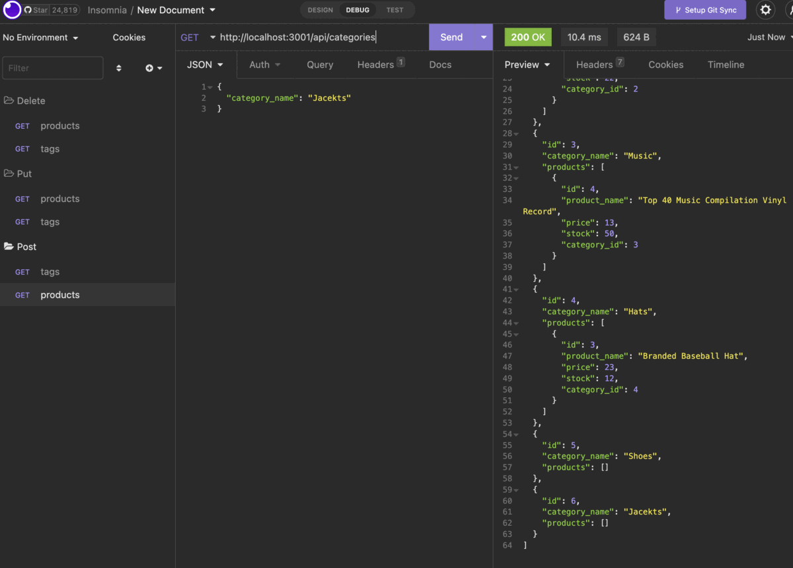

# E-Commerce Database

## Description

With E-Commerce Database app, your E-commerce platforms can provide a suite of services to businesses of all sizes. Having an app to keep track of all inventory details is crucial for an internet reatail store.


## Table Of Contents

* [Description](#description)
* [User Story](#user-story)
* [Installation](#installation)
* [Mock Up](#mock-up)
* [Video Walkthrough](#video-walkthrough)
* [GitHub Repository](#github-repository)

## User Story

```md
AS a manager at an internet retail company
I want a back end for my e-commerce website that uses the latest technologies, so my company can compete with other e-commerce companies. The app will provide an inventory to keep track of my company. 
```

## Installation

* express
* dotenv
* mysql2
* sequelize

## Mock-Up







## Video Walkthrough

https://arama89.github.io/E-Commerce-Database/

## GitHub Repository

https://github.com/AramA89/E-Commerce-Database